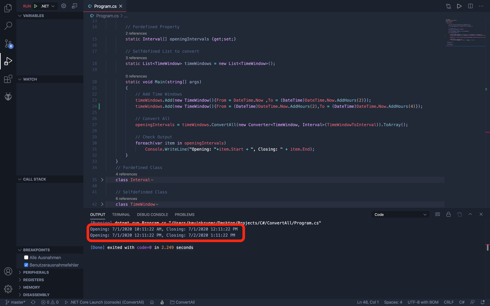

# Convert All
In this scenario we convert a self defined list into a predefined array without using a foreach loop.
This can be useful if you want to do a conversion within an instance block and there are no other ways to do this cleverly. But it can also be useful if you are using an API and want to use your own logic.
This example only works in the arrays section!

